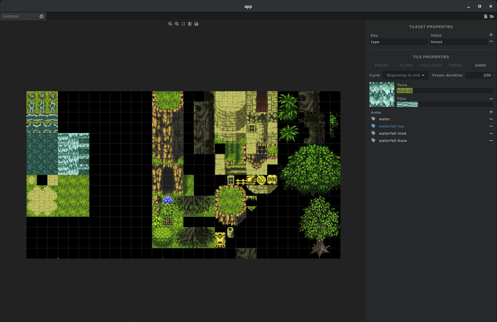

# About

Luna is a videogame editor I worked on as a side project, specifically aimed at
creating 2D top-down games (similar to SNES RPGs). The types of files it would
allow for editing include sprites, animations, tilesets, and maps, although
currently, only the tileset section is finished. The app is written using Vue,
and was created mostly as a way for me to become familiar with front-end web
development.

Note (6/27/20): I have decided to switch to using Svelte for this project after
reading up on it and looking at the differences with Vue. That repository is
found [here](https://github.com/litearc/luna).

